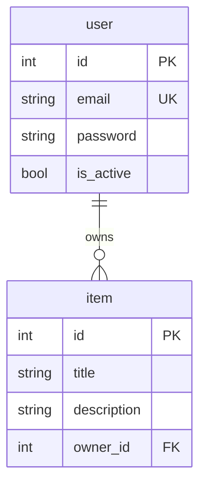

# Exercise I1 — ER Diagram from Repo

- Repo URL: https://github.com/ptrstn/fastapi-sqlalchemy-pytest-example
- Commit hash: `19047d784f20b60f5772661be67c98b6ac90e248`
- Date analyzed: `2026-06-16`
- Source file: `src/mypackage/models.py`

## Overview

The application defines two SQLModel ORM entities mapped to database tables: `User` and `Item`. A one-to-many relationship links users to the items they own via `Item.owner_id` → `User.id`.

## Entities

### `user` table (`User` model)

| Column | Type | Constraints | Source |
|---|---|---|---|
| `id` | `int` | Primary key, indexed | `src/mypackage/models.py` — `User.id` |
| `email` | `str` | Indexed, unique | `src/mypackage/models.py` — `User.email` |
| `password` | `str` | — | `src/mypackage/models.py` — `User.password` |
| `is_active` | `bool` | Default `True` | `src/mypackage/models.py` — `User.is_active` |

### `item` table (`Item` model)

| Column | Type | Constraints | Source |
|---|---|---|---|
| `id` | `int` | Primary key, indexed | `src/mypackage/models.py` — `Item.id` |
| `title` | `str` | Indexed | `src/mypackage/models.py` — `Item.title` |
| `description` | `str` (optional) | Indexed, nullable | `src/mypackage/models.py` — `Item.description` |
| `owner_id` | `int` (optional) | Foreign key → `user.id` | `src/mypackage/models.py` — `Item.owner_id` |

## Keys and Relationships

| Kind | From | To | Cardinality | Source |
|---|---|---|---|---|
| Primary key | `user.id` | — | — | `src/mypackage/models.py` — `User.id` |
| Primary key | `item.id` | — | — | `src/mypackage/models.py` — `Item.id` |
| Foreign key | `item.owner_id` | `user.id` | Many items → one user (optional) | `src/mypackage/models.py` — `Item.owner_id` |
| ORM relationship | `User.items` | `Item` | One user → many items | `src/mypackage/models.py` — `User.items` (`back_populates="owner"`) |
| ORM relationship | `Item.owner` | `User` | One item → one user (optional) | `src/mypackage/models.py` — `Item.owner` (`back_populates="items"`) |

Notes:

- `owner_id` is nullable (`Optional[int]`), so an item may exist without an assigned owner at the DB level.
- SQLModel maps class `User` to table name `user` and class `Item` to table name `item` (default lowercase naming).
- The FK target string in code is `"user.id"`.

## Mermaid ER Diagram

Legend: `PK` = primary key, `FK` = foreign key, `UK` = unique constraint.
