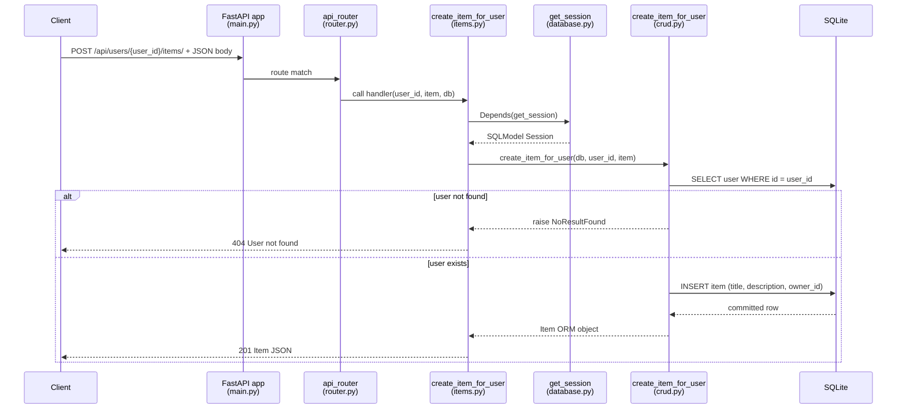

# Exercise I2 — End-to-End Flow Trace

- Repo URL: https://github.com/ptrstn/fastapi-sqlalchemy-pytest-example
- Commit hash: `19047d784f20b60f5772661be67c98b6ac90e248`
- Date analyzed: `2026-06-16`
- Traced flow: **`POST /api/users/{user_id}/items/`** — create an item owned by a user

## Entry point

| Field | Value |
|-------|-------|
| HTTP method | `POST` |
| Path | `/api/users/{user_id}/items/` |
| Example body | `{"title": "Item2", "description": "optional"}` |
| Success | `201 Created` + item JSON |
| Failure (missing user) | `404` — `User with id '{user_id}' not found` |

---

## Step-by-step file and function path

| Step | Layer | File | Function / symbol | What happens |
|------|-------|------|-------------------|--------------|
| 1 | App bootstrap | `src/mypackage/main.py` | `app`, `lifespan` | FastAPI app starts; on startup calls `create_db_and_tables()` |
| 2 | Router mount | `src/mypackage/main.py` | `app.include_router(api_router)` | Mounts all `/api/*` routes |
| 3 | Router aggregation | `src/mypackage/api/v1/router.py` | `api_router.include_router(items.router)` | Registers items endpoints under `/api` prefix |
| 4 | HTTP handler | `src/mypackage/api/v1/endpoints/items.py` | `create_item_for_user` | FastAPI matches path param `user_id`, parses JSON body as `schemas.ItemCreate` |
| 5 | Dependency injection | `src/mypackage/database.py` | `get_session` | Yields SQLModel `Session` bound to SQLite engine (request-scoped) |
| 6 | CRUD | `src/mypackage/crud.py` | `create_item_for_user` | Loads user by id; builds `Item`; persists to DB |
| 7 | ORM model | `src/mypackage/models.py` | `User`, `Item` | `Item.owner_id` FK → `user.id`; relationship via `owner` |
| 8 | Response schema | `src/mypackage/schemas.py` | `Item` | Serializes ORM object to JSON (`id`, `title`, `description`, `owner_id`) |
| 9 | Error mapping | `src/mypackage/api/v1/endpoints/items.py` | `create_item_for_user` | Catches `NoResultFound` → raises `HTTPException(404)` |

### CRUD detail (`create_item_for_user`)

1. `db.get(models.User, user_id)` — SELECT user by primary key
2. If missing → `raise NoResultFound(...)`
3. `models.Item(**item.model_dump(), owner=db_user)` — construct row with FK via relationship
4. `db.add(db_item)` → `db.commit()` → `db.refresh(db_item)` — INSERT into `item` table
5. Return `db_item` to handler → FastAPI serializes to `schemas.Item`

---

## External dependencies

| Dependency | Role in this flow | Source |
|------------|-------------------|--------|
| **FastAPI** | Routing, DI, request/response validation | `items.py`, `main.py` |
| **Pydantic** | `ItemCreate` request body validation | `schemas.py` |
| **SQLModel / SQLAlchemy** | ORM session, `db.get`, `commit` | `crud.py`, `database.py`, `models.py` |
| **SQLite** | Persistent storage (default `db.sqlite`) | `settings.py` → `database.py` |
| **pydantic-settings** | DB connection config from env / `.env` | `settings.py` |

No external HTTP APIs or message queues in this path.

---

## DB and side effects

| Side effect | Detail |
|-------------|--------|
| **Read** | `SELECT` from `user` where `id = {user_id}` |
| **Write** | `INSERT` into `item` with `title`, `description`, `owner_id` |
| **FK** | `item.owner_id` → `user.id` (`models.py`) |
| **Transaction** | Single commit in `crud.create_item_for_user` |

On app startup (before any request), `create_db_and_tables()` in `database.py` ensures `user` and `item` tables exist via `SQLModel.metadata.create_all(engine)`.

---

## Sequence diagram



---

## Known uncertainties

| Topic | Note |
|-------|------|
| Exact SQL statements | SQLModel/SQLAlchemy generate SQL; not spelled out explicitly in repo — inferred from ORM calls |
| `owner_id` population | Set via `owner=db_user` relationship kwarg; SQLModel may set FK before flush |
| Session lifecycle | `get_session` uses `with Session(engine)` generator; exact commit/rollback on unhandled errors depends on FastAPI dependency teardown |
| Test vs prod DB | Tests use in-memory SQLite via `.test.env` (`DB_DATABASE=:memory:`); local dev may use `db.sqlite` file |
| Password in User model | Not involved in this endpoint — only `user_id` lookup, not authentication |

---

## How to reproduce this flow

```bash
git clone https://github.com/ptrstn/fastapi-sqlalchemy-pytest-example.git
cd fastapi-sqlalchemy-pytest-example
git checkout 19047d784f20b60f5772661be67c98b6ac90e248
pip install -e ".[test]"
uvicorn mypackage.main:app --reload

# Create user first
curl -X POST http://127.0.0.1:8000/api/users/ \
  -H "Content-Type: application/json" \
  -d '{"email":"test@example.com","password":"secret"}'

# Create item for user id 1
curl -X POST http://127.0.0.1:8000/api/users/1/items/ \
  -H "Content-Type: application/json" \
  -d '{"title":"Item2"}'
```

Automated coverage of this path: `tests/test_api.py::test_create_item_for_user`
